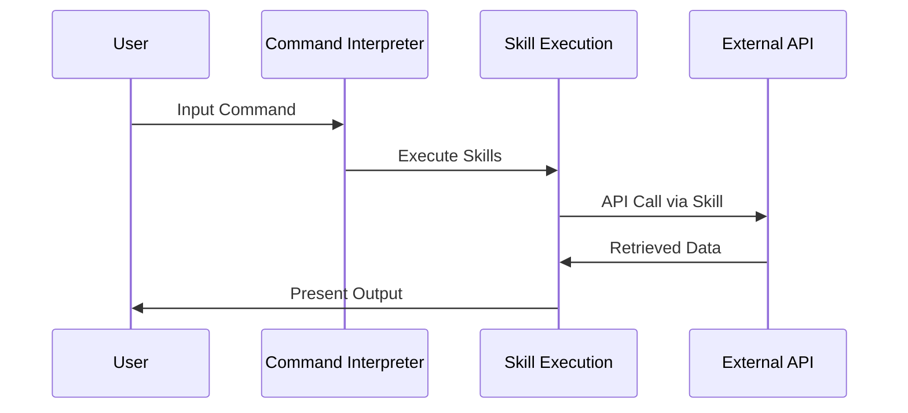

# Data Processing Flow Architecture

## Overview
A simplified flow designed to process user commands by leveraging skills to obtain additional information and retrieve output. This flow focuses on two main operations: command interpretation and data retrieval, with minimal processing.

## Flow Purpose
To create a straightforward pipeline that can:
1. Understand user commands and requirements
2. Use skills to fetch additional data
3. Retrieve and present the output

## Flow Components

### 1. Command Interpreter Agent
- Analyzes user input and determines requirements
- Identifies necessary skills for data retrieval
- Prepares instructions for skill execution

### 2. Skill Execution Agent
- Executes skills to obtain additional information
- Manages API interactions through skills
- Collects and formats the retrieved data

## Flow Diagram

### Simplified Operation Flow

## Operation Flow
1. User provides command with requirements
2. Command Interpreter identifies necessary skills
3. Skill Execution Agent uses skills to fetch data
4. Retrieved data is presented to the user

## Integration Requirements
- Python skills for API interactions
- JSON processing capabilities
- Basic error handling

## Error Handling
- Invalid command format
- Skill execution failures
- API access issues

## Performance Considerations
- Efficient skill execution
- Minimal processing overhead
- Quick response times 