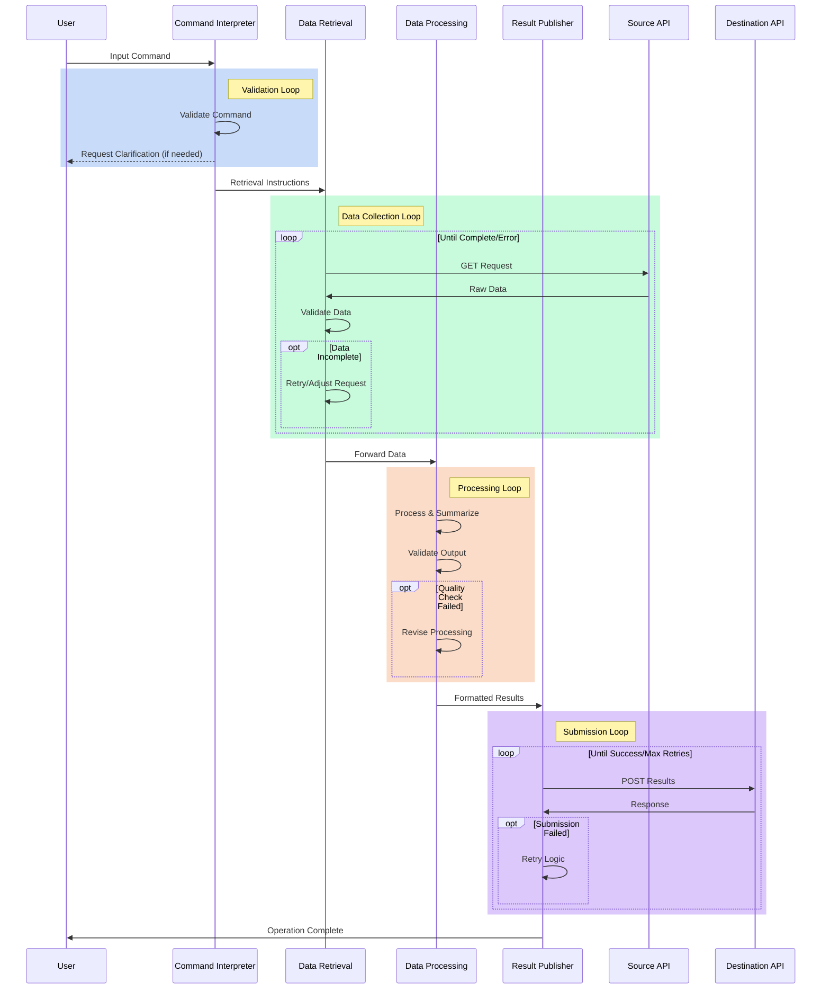
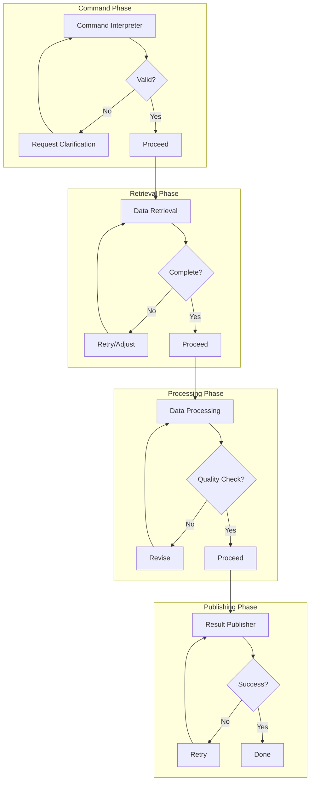

# Data Processing Flow Architecture

## Overview
A streamlined flow designed to process user commands, retrieve data via APIs, summarize information, and post results. This flow focuses on three main operations: command interpretation, data retrieval (GET), and result submission (POST), with built-in validation and feedback loops.

## Flow Purpose
To create an efficient pipeline that can:
1. Understand user commands and requirements
2. Fetch relevant data from specified APIs
3. Process and summarize the information
4. Submit results to destination APIs
5. Ensure quality through validation cycles

## Flow Components

### 1. Command Interpreter Agent
- Analyzes user input and determines requirements
- Identifies source and destination APIs
- Extracts search parameters and criteria
- Determines data processing requirements
- Validates command feasibility

### 2. Data Retrieval Agent
- Handles GET requests to source APIs
- Manages API authentication and headers
- Collects and aggregates data
- Implements error handling and retries
- Validates data completeness

### 3. Data Processing Agent
- Processes and summarizes collected data
- Formats information according to requirements
- Prepares data for submission
- Validates output format
- Handles revision requests

### 4. Result Publisher Agent
- Handles POST requests to destination APIs
- Ensures proper data submission format
- Manages response handling
- Confirms successful delivery
- Implements retry logic

## Flow Diagrams

### Main Operation Flow

### Validation Cycles

## Operation Flow
1. User provides command with requirements
   - Command validation cycle
   - Clarification requests if needed
2. Data Retrieval Agent fetches information
   - Data completeness validation
   - Retry logic for failed requests
3. Data Processing Agent summarizes data
   - Quality validation cycle
   - Processing revision if needed
4. Result Publisher Agent submits results
   - Submission validation
   - Retry logic for failed submissions
5. User receives completion confirmation

## Integration Requirements
- Python requests library for API calls
- JSON processing capabilities
- Basic authentication handling
- Error handling and logging
- Retry mechanism implementation

## Error Handling
- Invalid command format
- API access failures
- Data processing errors
- Submission failures
- Maximum retry limits

## Performance Considerations
- Batch processing for multiple API calls
- Response size management
- Request rate limiting
- Basic error recovery
- Validation cycle optimization 