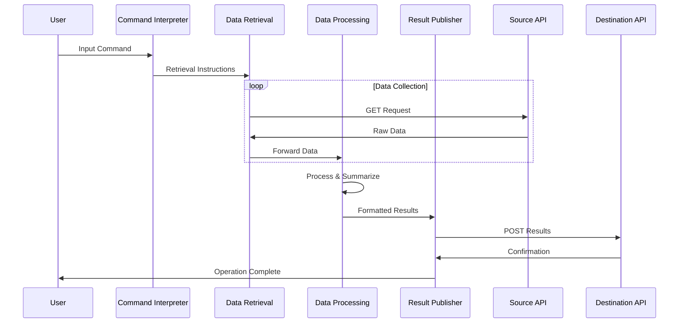
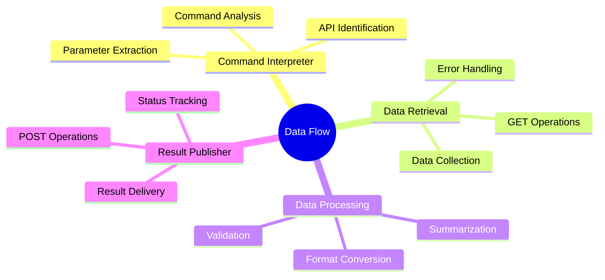

# Data Processing Flow Architecture

## Overview
A streamlined flow designed to process user commands, retrieve data via APIs, summarize information, and post results. This flow focuses on three main operations: command interpretation, data retrieval (GET), and result submission (POST).

## Flow Purpose
To create an efficient pipeline that can:
1. Understand user commands and requirements
2. Fetch relevant data from specified APIs
3. Process and summarize the information
4. Submit results to destination APIs

## Flow Components

### 1. Command Interpreter Agent
- Analyzes user input and determines requirements
- Identifies source and destination APIs
- Extracts search parameters and criteria
- Determines data processing requirements

### 2. Data Retrieval Agent
- Handles GET requests to source APIs
- Manages API authentication and headers
- Collects and aggregates data
- Implements error handling and retries

### 3. Data Processing Agent
- Processes and summarizes collected data
- Formats information according to requirements
- Prepares data for submission
- Validates output format

### 4. Result Publisher Agent
- Handles POST requests to destination APIs
- Ensures proper data submission format
- Manages response handling
- Confirms successful delivery

## Flow Diagram

## Agent Responsibilities

## Operation Flow
1. User provides command with requirements
2. Command Interpreter analyzes and structures the request
3. Data Retrieval Agent fetches required information
4. Data Processing Agent summarizes the collected data
5. Result Publisher Agent submits the processed information
6. User receives completion confirmation

## Integration Requirements
- Python requests library for API calls
- JSON processing capabilities
- Basic authentication handling
- Error handling and logging

## Error Handling
- Invalid command format
- API access failures
- Data processing errors
- Submission failures

## Performance Considerations
- Batch processing for multiple API calls
- Response size management
- Request rate limiting
- Basic error recovery 