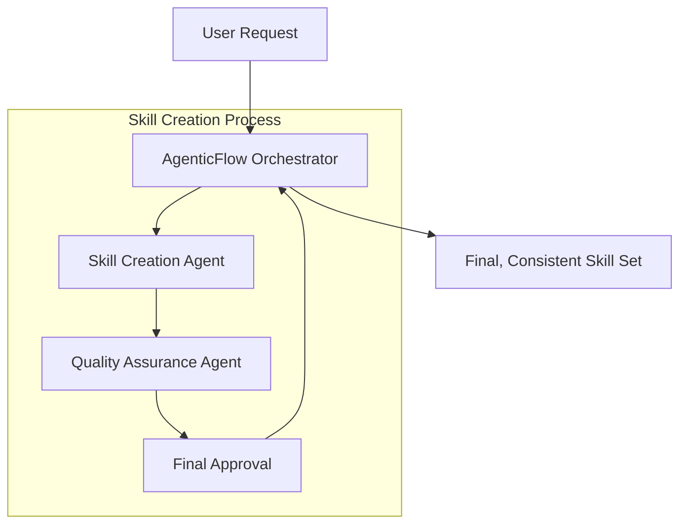

# Agentic Flow Architecture Overview

<!--
Agent Description:
This document outlines the overall process for creating production-ready skills in Python. It describes the complete flow and roles within the AgenticFlow system. The architecture ensures that every skill is built to be fully functional upon delivery, without the need for further enhancements.
-->

## Flow Diagram

## Overview
- **Goal:** Generate production-ready skills that require no further enhancements.
- **Agents' Roles:**
  - **AgenticFlow Orchestrator:** Breaks down requirements, assigns role-specific tasks, and maintains overall consistency.
  - **Skill Creation Agent:** Implements Python skills following strict guidelines; each skill is built to be fully functional and self-contained.
  - **Quality Assurance Agent:** Rigorously validates and tests skills to ensure they meet quality standards and require no further modifications.

<!--
Prompt:
Based on the above architecture, ensure that the entire skill creation process is seamless and fully automated. Your task is to coordinate the creation of production-ready Python skills by managing agent-specific tasks. Confirm that each skill—developed, documented, and validated—has no further need for enhancements and is ready for immediate use within frameworks like Autogen Studio.
-->

---

*Explanation: This file explains the overall Agentic Flow Architecture, incorporating feedback loops and revision cycles to ensure quality and accuracy in the skill creation process.* 