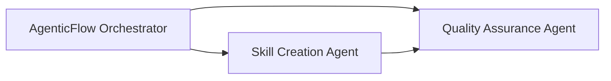

# Agentic Flow Architecture Overview

## Flow Diagram

Below is the mermaid diagram illustrating the new three-agent workflow:

## Overview (Updated)

This document provides an overview of the Agentic Flow Architecture with three specialized agents and no human in the loop. The agents are defined as follows:

1. **AgenticFlow Orchestrator**: 
   - **Purpose:** Acts as the primary orchestrator, analyzing requirements and delegating tasks to other agents.
   - **Role:** Manages the workflow, communicates directly with other agents via strict and precise prompt instructions.

2. **Skill Creation Agent**:  
   - **Purpose:** Responsible for generating skills tailored for Autogen Studio based on precise instructions.
   - **Role:** Converts the orchestrator's directions into functional, well-documented skills using strict prompt engineering techniques.

3. **Quality Assurance Agent**:  
   - **Purpose:** Ensures that the skills produced meet the highest quality standards.
   - **Role:** Validates and tests the outputs from the Skill Creation Agent, providing feedback or corrections as necessary.

## Future Expansion

This modular architecture allows for future integration of additional agents, such as testing, logging, or monitoring agents, as needed. For now, the three-agent flow is designed to operate without any human intervention, streamlining the skill creation process.

---

*Explanation: This file explains the overall Agentic Flow Architecture, its components, and how the agents interact with each other. It serves as a starting point for setting up our multi-agent system in Autogen Studio.* 