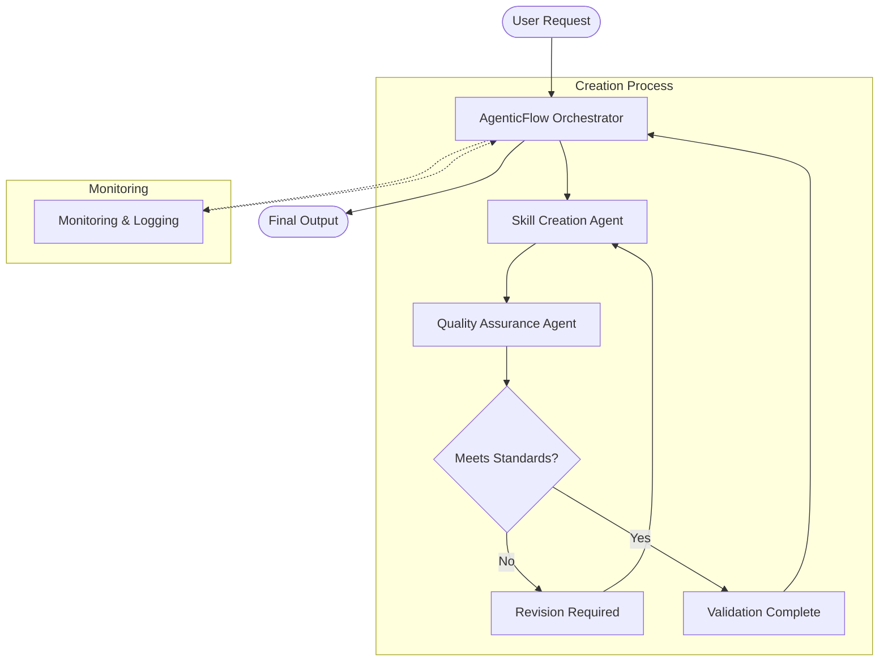

# Agentic Flow Architecture Overview

## Flow Diagram

Below is the mermaid diagram illustrating the workflow with feedback loops:

## Overview (Updated)

This document provides an overview of the Agentic Flow Architecture with three specialized agents and feedback loops. The agents are defined as follows:

1. **AgenticFlow Orchestrator**: 
   - **Purpose:** Acts as the primary orchestrator, analyzing requirements and delegating tasks to other agents.
   - **Role:** Manages the workflow, communicates directly with other agents via strict and precise prompt instructions.
   - **Feedback Management:** Coordinates revision cycles and ensures quality standards are met.

2. **Skill Creation Agent**:  
   - **Purpose:** Responsible for generating skills tailored for Autogen Studio based on precise instructions.
   - **Role:** Converts the orchestrator's directions into functional, well-documented skills using strict prompt engineering techniques.
   - **Revision Handling:** Implements changes based on QA feedback.

3. **Quality Assurance Agent**:  
   - **Purpose:** Ensures that the skills produced meet the highest quality standards.
   - **Role:** Validates and tests the outputs from the Skill Creation Agent, providing feedback or corrections as necessary.
   - **Feedback Loop:** Initiates revision cycles when standards are not met.

## Process Flow

1. **Initial Request Phase**
   - User submits request
   - Orchestrator analyzes requirements
   - Tasks are delegated to appropriate agents

2. **Creation Phase**
   - Skill Creation Agent develops initial implementation
   - Output is passed to QA Agent
   - Quality standards are verified

3. **Revision Cycle**
   - QA Agent provides detailed feedback
   - Skill Creation Agent implements revisions
   - Process repeats until quality standards are met

4. **Finalization Phase**
   - Final validation is performed
   - Documentation is updated
   - Output is prepared for deployment

## Quality Control Points

1. **Initial Validation**
   - Requirements completeness
   - Technical feasibility
   - Scope verification

2. **Development Checkpoints**
   - Code quality
   - Documentation completeness
   - Implementation accuracy

3. **Final Verification**
   - Functionality testing
   - Documentation review
   - Integration validation

## Future Expansion

This modular architecture allows for future integration of additional agents, such as testing, logging, or monitoring agents, as needed. The feedback loops ensure continuous improvement and quality maintenance throughout the process.

---

*Explanation: This file explains the overall Agentic Flow Architecture, incorporating feedback loops and revision cycles to ensure quality and accuracy in the skill creation process.* 