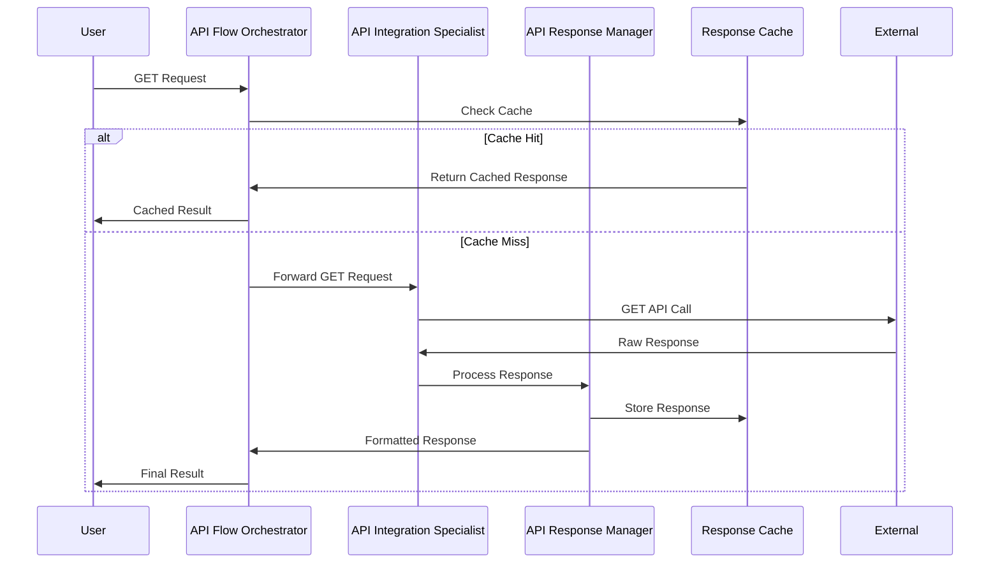
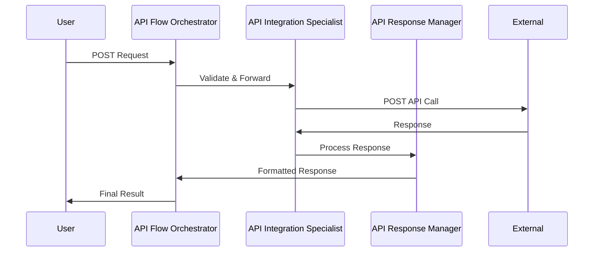
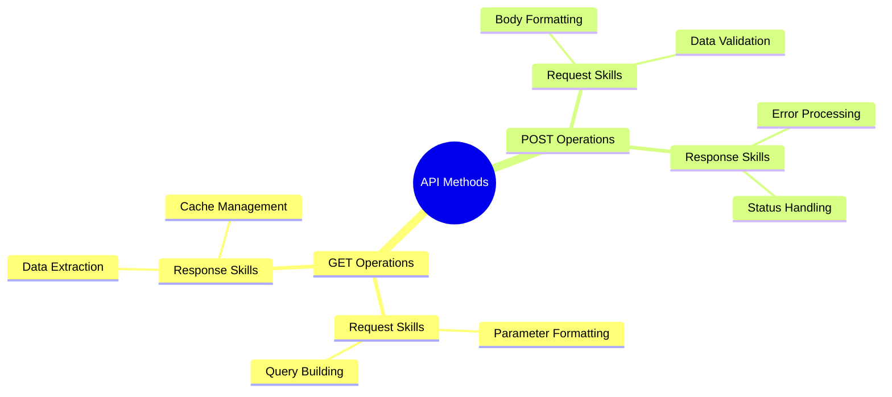

# API Expert Flow Architecture

## Overview
The API Expert flow is designed to handle basic HTTP GET and POST API interactions within the Autogen Studio environment. This flow leverages pre-existing Python skills to manage API requests and responses, focusing on data retrieval (GET) and submission (POST) operations.

## Available Methods

### 1. GET Operations
- Data retrieval from external APIs
- Parameter handling and query string formatting
- Response parsing and data extraction
- Cached responses for improved performance

### 2. POST Operations
- Data submission to external APIs
- Request body formatting and validation
- Response handling and confirmation
- Error handling and retry logic

## Flow Components

### 1. API Flow Orchestrator
- Determines whether to use GET or POST method
- Coordinates request flow between agents
- Manages operation state and error handling
- Uses skills: Request Routing, Error Management

### 2. API Integration Specialist
- Executes GET and POST requests
- Handles authentication and headers
- Manages request/response cycle
- Uses skills: API Authentication, Request Execution

### 3. API Response Manager
- Processes API responses
- Formats data according to requirements
- Implements basic response caching
- Uses skills: Response Formatting, Data Validation

## Flow Diagrams

### GET Operation Flow

### POST Operation Flow

### Required Skills Per Operation

## Flow Sequence
1. User initiates GET or POST request
2. Orchestrator determines method and required skills
3. Integration Specialist executes the API call
4. Response Manager processes and formats the response
5. Result returned to user

## Integration Points
- Uses existing Python skills for API interactions
- Implements basic caching for GET requests
- Handles standard HTTP headers and authentication
- Supports JSON request/response formats

## Error Handling
- Request validation errors
- API connection failures
- Response timeout handling
- Invalid data format handling

## Performance Considerations
- GET request caching
- Response size optimization
- Basic rate limiting
- Connection pooling 