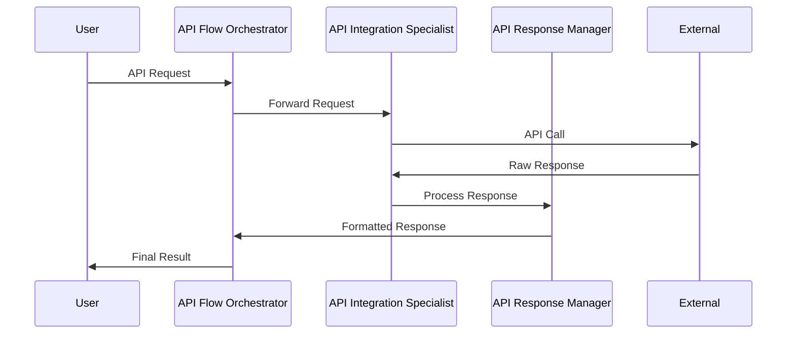
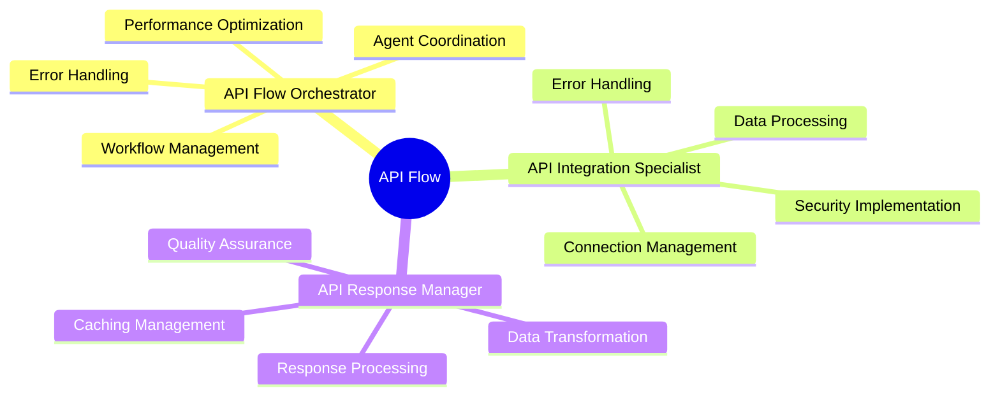

# API Expert Flow Architecture

## Overview
The API Expert flow is designed to handle API interactions within the Autogen Studio environment. This flow manages both incoming API requests for data retrieval and outgoing API responses, ensuring smooth data flow and proper API integration.

## Flow Components

### 1. API Flow Orchestrator
- Central manager of API operations
- Oversees the entire API interaction lifecycle
- Coordinates tasks between Integration Specialist and Response Manager
- Ensures secure, efficient, and error-free operations
- Manages state and performance across the system

### 2. API Integration Specialist
- Manages direct API interactions and secure data exchange
- Establishes and maintains API connections
- Processes API requests and responses
- Implements security protocols and data validation
- Ensures reliable and efficient API communication

### 3. API Response Manager
- Ensures API responses are properly formatted, validated, and optimized
- Implements caching and optimization strategies
- Manages response transformations
- Maintains response delivery standards
- Ensures data quality and consistency

## Flow Diagrams

### Agent Interaction Flow

### Required Skills Per Agent

## Flow Sequence
1. Flow Orchestrator receives the initial request
2. Integration Specialist is activated for API interaction
3. Response Manager processes and formats the data
4. Flow Orchestrator validates the complete process
5. Final response is delivered back to the system

## Integration Points
- Seamless integration with existing skill system
- Utilizes pre-defined skills for API handling
- Maintains consistent error handling patterns
- Supports both synchronous and asynchronous operations

## Security Considerations
- API authentication management
- Data encryption in transit
- Rate limiting and quota management
- Secure credential handling
- Input validation and sanitization

## Future Enhancements
- Support for additional API protocols
- Enhanced caching mechanisms
- Advanced error recovery
- Performance optimization
- Extended monitoring capabilities 